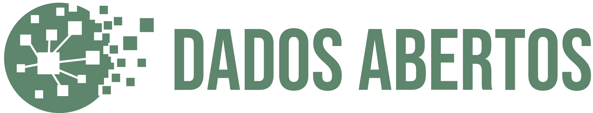

<h1 align="center">Dados Abertos - Ckan</h1>
<h2 align="center">A frontend that serves infos from CKAN using hte CKAN API.</h2>

  

CKAN is an open-source DMS (data management system) for powering data hubs and data portals. CKAN makes it easy to publish, share and use data. It powers hundreds of data portals worldwide. Unfortunately, customize CKAN appearance can bit a bit hard. This project aims to provide a alternative frontend for simple visitors of your CKAN service. 

[know more about CKAN](https://ckan.org/)

#### Status of this project
In stand by

### Licence

 Dados Abertos Ckan by Ricardo Ireno is licensed under a <a rel="license" href="http://creativecommons.org/licenses/by-nc/4.0/">Creative Commons Attribution-NonCommercial 4.0 International License</a>. Based on a work at <a xmlns:dct="http://purl.org/dc/terms/" href="https://github.com/RicardoIreno/dados-abertos-ckan" rel="dct:source">https://github.com/RicardoIreno/dados-abertos-ckan</a>.

## Contact

  

Ricardo Ireno  

Project Link: [https://github.com/RicardoIreno/dados-abertos-ckan](https://github.com/RicardoIreno/dados-abertos-ckan)

(<a href="#top">back to top</a>)

